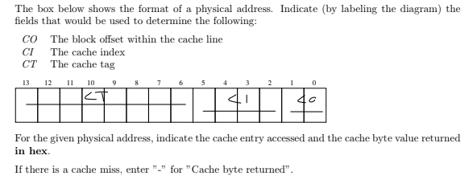
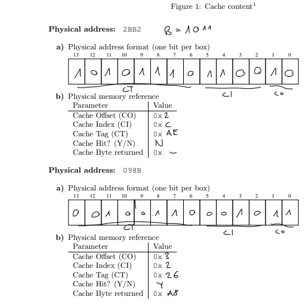
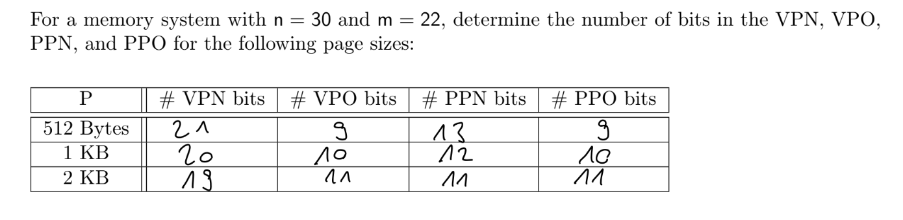

# Assignment 10

## Part 1

### Question 1

### Question 2

a) the last 128 always hit, from the first 128 we always miss because the block size is only 4 bytes (i.e. one integer), therefore 50%

b) in the first loop, we hit half of the time, in the second loop we always hit, therefore 25% misses

## Part 2

### Question 3

### Question 4

see file on notability
