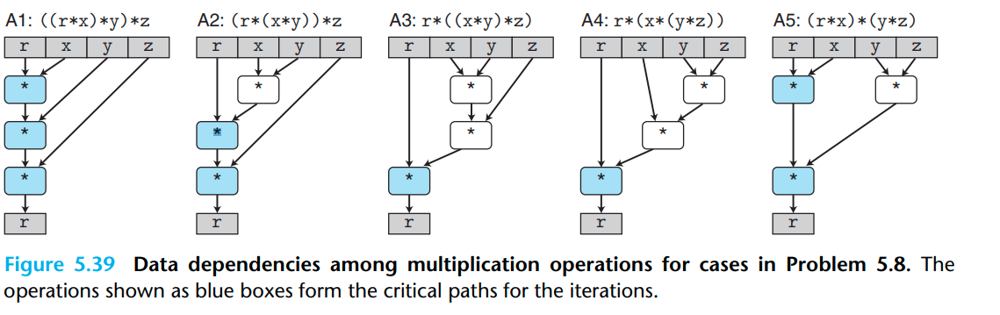

# Assignment 9

## Question 1

- Measured CPE for A3: the computation graph of A3 and A4 are the same, therefore we have 1.67
- Measured CPE for A5: we rely on r from the previous iteration, the other computation can be done in parallel, final multiplication with both of these results, therefore same situation as in A2

> For example for version A1,
each multiplication depends on the previous value of r. Hence, each multiplication must wait until
the previous multiplication is finished, which takes 5 cycles. In contrast, version A3 includes only
one such critical multiplication that takes an old r and computes a new one. Hence, only 5 cycles
are required to multiply 3 elements (assuming that the non-critical multiplications go through the
pipeline in between the critical multiplications)

| Version | Measured CPE | Theoretical CPE |
| ------- | ------------ | --------------- |
| A1      | 5.00         | 5.00            |
| A2      | 3.67         | 10/3            |
| A3      | 1.67         | 5/3             |
| A4      | 1.67         | 5/3             |
| A5      | 3.67         | 10/3            |

## Question 2

No, `movl (%rdi), %eax` might cause a page fault (e.g. if we're accessing a null pointer).

## Question 3

a) each element contains a[i] = i + 1, except a[999] = 999

b) each element contains a[i] = 0

c) in the second call, we need to wait for the store to finish before reading the new value, in the first call we can directly read the value, the value we read does not depend on a previous store, write/read dependency

d) here the read also does not depend on a previous store, therefore we should expect a CPE of 3.00

## Reflection

scales slightly below expected complexity of O(n^3), effect of caches
